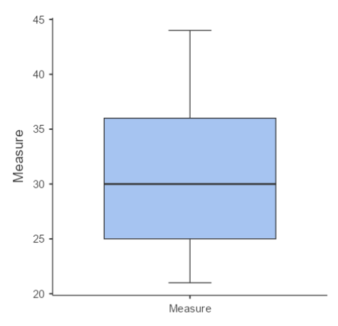

# Box and Whisker Plots

A **box plot** (or **box-and-whisker plot**) is a standardised way of displaying the distribution of data based on a five-number summary:

<ul>
    <li>Minimum: The smallest value in the dataset.</li>
    <li>First Quartile (Q1): The 25th percentile, marking the end of the first quarter of the data.</li>
    <li>Median (Q2): The middle value of the dataset, also the 50th percentile.</li>
    <li>Third Quartile (Q3): The 75th percentile, marking the end of the third quarter of the data.</li>
    <li>Maximum: The largest value in the dataset.</li>
</ul>

It is particularly useful for:
                <ul>
                    <li>Visualising the spread, skewness, and potential outliers of a dataset.</li>
                    <li>Comparing distributions between different groups or categories at a glance.</li>
                </ul>

### Questions

Here is a dataset summarised by a box and whisker plot.









    <a href="{{ "/descriptive/" | relative_url }}">← Return to Descriptive Statistics Menu</a>


